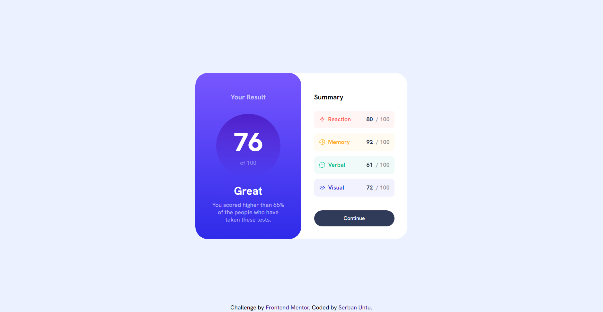

# Frontend Mentor - Results summary component solution

This is a solution to the [Results summary component challenge on Frontend Mentor](https://www.frontendmentor.io/challenges/results-summary-component-CE_K6s0maV).

## Table of contents

- [Overview](#overview)
  - [The challenge](#the-challenge)
  - [Screenshot](#screenshot)
  - [Links](#links)
- [My process](#my-process)
  - [Built with](#built-with)
  - [What I learned](#what-i-learned)
  - [Continued development](#continued-development)
  - [Useful resources](#useful-resources)
- [Author](#author)

## Overview

### The challenge

Users are able to:

- [x] View the optimal layout for the interface depending on their device's screen size
- [x] See hover and focus states for all interactive elements on the page
- [x] **Bonus**: View the content which was dynamically populated using JSON data.

### Screenshot



### Links

- [Solution](https://www.frontendmentor.io/solutions/json-data-fetching-flexbox-semantic-html-responsive-layout-OFwzIGbfyo)
- [Live Site](https://fm-results-summary-component-serbanuntu.vercel.app)

## My process

### Built with

- Semantic HTML
- CSS custom properties
- CSS Flexbox

### What I learned

I learned about the use of `rem` and how it is preffered over other units when setting up font sizes.

I utilised the `float` property to lock the scores to the right side of their respective container:

```css
.component-score {
    /* ... */
    display: inline;
    text-align: right;
    float: right;
}
```

I also expanded my knowledge about pseudoclasses. I used `nth-of-type`, which allows for the selection of individual elements in a list, without needing to create separate classes:

```css
.component:nth-of-type(1) .component-name p { /* ... */ }

.component:nth-of-type(2) .component-name p { /* ... */ }

/* ... */
```

### Continued development

I want to develop my CSS skills with future projects, to learn about CSS Grid and more.

I also want to adopt a more systematic way of dealing with CSS in the future, like Sass or Tailwind.

### Useful resources

- [This](https://www.youtube.com/watch?v=N5wpD9Ov_To) video has information about underrated CSS units.
- The Mozilla references for [HTML](https://developer.mozilla.org/en-US/docs/Web/HTML) and [CSS](https://developer.mozilla.org/en-US/docs/Web/CSS) are always useful.

## Author

- LeetCode - [@SerbanUntu](https://leetcode.com/SerbanUntu/)
- Github - [@SerbanUntu](https://github.com/SerbanUntu)
- Frontend Mentor - [@SerbanUntu](https://www.frontendmentor.io/profile/SerbanUntu)
